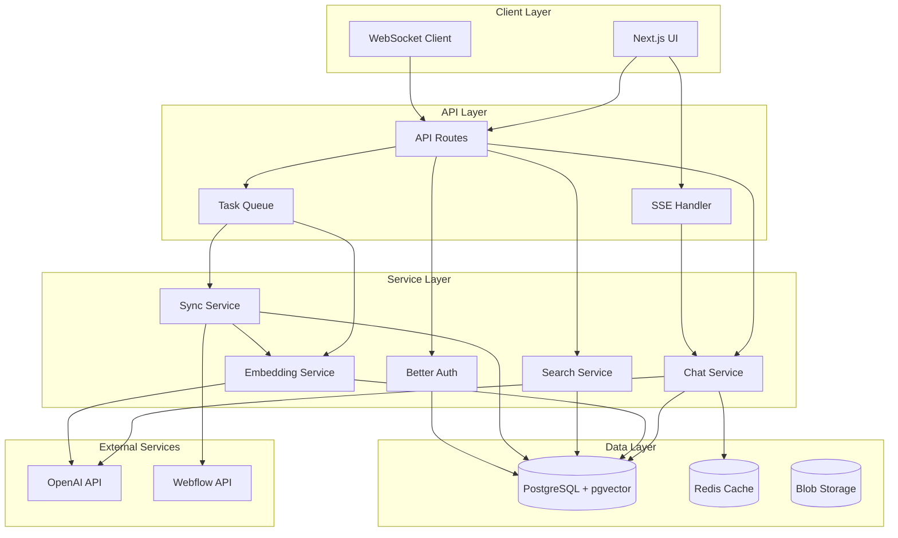

# Content Chat Feature - Product Requirements Document

**Sidebar Label:** Content Chat

---

## 1. Overview

**Content Chat** is an AI-powered conversational interface integrated into Interlink that enables users to query, analyze, and bulk-edit content from their Webflow-hosted blogs and websites. The feature leverages vector search with pgvector, OpenAI embeddings, and natural language processing to provide instant access to content insights and editing capabilities without leaving the Interlink dashboard.

This feature extends Interlink's core value proposition of managing compliant card references by adding intelligent content discovery and management capabilities for marketing teams managing large content libraries in Webflow.

### Key Technologies
- **Vector Search**: PostgreSQL with pgvector extension (HNSW indexing)
- **AI/ML**: OpenAI `text-embedding-3-small` for embeddings, GPT-4o for chat
- **Streaming**: Server-Sent Events (SSE) for real-time responses
- **CMS Integration**: Webflow Data API v1 with OAuth 2.0
- **Framework**: Next.js 15.3.4 App Router with Server Components

---

## 2. Objectives & Success Metrics

### Primary Objectives
- **Reduce content audit time** by 75% through conversational search
- **Enable bulk content updates** across multiple posts in seconds
- **Improve compliance accuracy** by identifying all card/term references
- **Provide instant content insights** without manual searching
- **Minimize API costs** through intelligent caching and vector search

### Success Metrics
- **Performance**: 
  - 95th-percentile vector search < 200ms (HNSW index)
  - Time to first token < 500ms for chat responses
  - Embedding generation < 300ms per chunk
- **Accuracy**: 
  - ≥ 95% recall for term-presence queries
  - ≥ 90% precision for semantic search
- **Adoption**: 
  - ≥ 50% of active users execute at least one chat query within first month
  - Average 10+ queries per active user per week
- **Cost Efficiency**: 
  - ≥ 85% of queries served via vector search (no LLM call)
  - < $0.01 average cost per query
- **User Satisfaction**: 
  - NPS score ≥ 8 for Content Chat feature
  - < 2% error rate in production

---

## 3. User Stories

### Primary User Stories

1. **Operations Manager**
   - "As an ops manager, I want to find every mention of a specific card name across all our content so I can ensure compliance with updated terms."
   - "As an ops manager, I need to verify that all card references use the correct legal terminology before our quarterly compliance review."
   - "As an ops manager, I want to generate compliance reports showing all non-compliant card mentions."

2. **Content Editor**
   - "As a content editor, I want to replace outdated card names or terminology across all blog posts with a single command."
   - "As a content editor, I need to find all posts that mention competitor cards to update comparisons."
   - "As a content editor, I want to preview all changes before applying bulk updates."

3. **SEO Specialist**
   - "As an SEO specialist, I want to discover which posts cover travel rewards for strategy planning."
   - "As an SEO specialist, I need to identify content gaps by querying uncovered topics."
   - "As an SEO specialist, I want to analyze keyword density across our content library."

4. **Marketing Manager**
   - "As a marketing manager, I want to audit brand consistency across all card mentions."
   - "As a marketing manager, I need to update promotional offers across multiple posts when benefits change."
   - "As a marketing manager, I want to track content performance metrics through natural language queries."

---

## 4. Functional Requirements

### 4.1 Webflow Integration

| ID  | Requirement | Priority | Implementation Notes |
| --- | --- | -------- | --- |
| FC1 | **OAuth 2.0 Connection**: Implement Webflow OAuth flow with secure token storage (encrypted in DB per user) | P0 | Use Better Auth's OAuth provider system |
| FC2 | **Collection Discovery**: List and cache CMS collections via `GET /collections` with proper versioning headers | P0 | Cache for 24 hours |
| FC3 | **Content Ingestion**: Implement paginated fetch with retry logic and exponential backoff | P0 | Batch size: 100 items |
| FC4 | **Incremental Sync**: Webhook listener for real-time updates + scheduled sync every 6 hours | P1 | Use Vercel Cron |
| FC5 | **Rate Limit Handling**: Parse `X-RateLimit-*` headers, implement queue with backoff strategy | P0 | Max 60 req/min |
| FC6 | **Token Refresh**: Automatic OAuth token refresh before expiration | P0 | Check token validity before each API call |
| FC7 | **Error Recovery**: Implement circuit breaker pattern for API failures | P1 | 3 failures = 5 min cooldown |

### 4.2 Content Processing & Storage

| ID  | Requirement | Priority | Implementation Notes |
| --- | --- | -------- | --- |
| FP1 | **Smart Chunking**: Implement semantic splitting by paragraphs/headings with overlap (100 tokens) | P0 | Max chunk: 1500 tokens |
| FP2 | **Embeddings Generation**: Use OpenAI `text-embedding-3-small` (1536 dimensions) with batch processing | P0 | Batch size: 100 chunks |
| FP3 | **Metadata Extraction**: Extract card names, URLs, dates, author using regex + NER | P1 | Store as JSONB |
| FP4 | **Vector Storage**: HNSW index on `vector(1536)` column with optimized parameters | P0 | m=16, ef_construction=64 |
| FP5 | **Data Isolation**: All operations scoped by `userId` with RLS policies | P0 | Foreign key to Better Auth |
| FP6 | **Content Deduplication**: Hash-based dedup to prevent duplicate chunks | P1 | SHA-256 of content |
| FP7 | **Version Tracking**: Track content versions for rollback capability | P2 | Soft delete old versions |

### 4.3 Chat Interface & Context Management

| ID  | Requirement | Priority | Implementation Notes |
| --- | --- | -------- | --- |
| FU1 | **Streaming Chat UI**: Implement SSE-based streaming with token-by-token display | P0 | Use React Server Components |
| FU2 | **Natural Language Processing**: Support complex queries with intent detection | P0 | System prompt optimization |
| FU3 | **Context Preservation**: | | |
| FU3.1 | - Reference Resolution: Implement pronoun resolution using conversation history | P0 | Last 10 messages |
| FU3.2 | - Context Window: Sliding window with importance scoring for context pruning | P0 | Max 8k tokens |
| FU3.3 | - State Management: Server-side conversation state with Redis caching | P1 | 30 min TTL |
| FU3.4 | - Disambiguation: Interactive clarification for ambiguous references | P0 | UI quick options |
| FU4 | **Quick Actions**: Contextual action buttons based on query type | P1 | "Edit All", "Export", "Preview" |
| FU5 | **Export Capabilities**: Generate CSV/JSON exports with formatting options | P2 | Background job queue |
| FU6 | **Voice Input**: Speech-to-text integration for hands-free queries | P3 | Web Speech API |

### 4.4 Search & Discovery

| ID  | Requirement | Priority | Implementation Notes |
| --- | --- | -------- | --- |
| FS1 | **Hybrid Search**: Combine vector similarity with keyword matching and BM25 ranking | P0 | Weighted scoring |
| FS2 | **Result Presentation**: Rich cards with highlighted snippets and relevance indicators | P0 | React components |
| FS3 | **Action Integration**: Deep links to Webflow editor + in-app preview | P0 | OAuth scope required |
| FS4 | **Relevance Scoring**: Multi-factor scoring with explanation | P1 | Show score breakdown |
| FS5 | **Advanced Filtering**: Faceted search by date, author, status, custom fields | P2 | PostgreSQL indexes |
| FS6 | **Re-ranking**: Implement two-stage retrieval with re-ranking for better recall | P1 | Fetch 3x, re-rank |

### 4.5 Content Editing

| ID  | Requirement | Priority | Implementation Notes |
| --- | --- | -------- | --- |
| FE1 | **Visual Diff**: Side-by-side comparison with syntax highlighting | P0 | Monaco Editor |
| FE2 | **Bulk Operations**: Queue-based updates with progress tracking | P0 | Bull queue + Redis |
| FE3 | **Validation**: Pre-flight checks for HTML validity and link integrity | P0 | Client + server |
| FE4 | **Undo System**: Transaction-based undo with 24-hour retention | P1 | Audit log table |
| FE5 | **Conflict Resolution**: Detect and handle concurrent edits gracefully | P2 | Last-write-wins + warnings |
| FE6 | **Template System**: Save and reuse common replacement patterns | P2 | User templates table |

### 4.6 Post Editor

| ID  | Requirement | Priority | Implementation Notes |
| --- | --- | -------- | --- |
| FD1 | **Rich Text Editor**: Full WYSIWYG with Webflow-compatible HTML output | P0 | Lexical/TipTap |
| FD2 | **Smart Navigation**: Auto-scroll with mini-map and occurrence counter | P0 | IntersectionObserver |
| FD3 | **Auto-save**: Debounced saves to draft status with conflict detection | P0 | 30s intervals |
| FD4 | **Version Control**: Git-like branching for content experimentation | P2 | Separate versions table |
| FD5 | **Collaboration**: Real-time presence and commenting | P3 | WebSocket integration |

---

## 5. Technical Architecture

### 5.1 Technology Stack

#### Frontend
- **Framework**: Next.js 15.3.4 (App Router)
- **Language**: TypeScript 5.x with strict mode
- **UI Components**: shadcn/ui + Radix UI primitives
- **State Management**: React Server Components + Client hooks
- **Styling**: TailwindCSS 4.0 with CSS variables
- **Real-time**: Server-Sent Events for streaming

#### Backend
- **Runtime**: Node.js 20.x on Vercel Edge Functions
- **Auth**: Better Auth 1.2.12 with session management
- **Database**: PostgreSQL 16 with pgvector 0.8.0
- **Cache**: Vercel KV (Redis) for conversation state
- **Queue**: Vercel Queue for bulk operations
- **Monitoring**: Vercel Analytics + Custom metrics

#### AI/ML
- **Embeddings**: OpenAI `text-embedding-3-small` (1536d)
- **Chat**: GPT-4o with streaming and function calling
- **Vector DB**: pgvector with HNSW indexing
- **Similarity**: Cosine distance with normalization

#### External Services
- **CMS**: Webflow Data API v1
- **CDN**: Vercel Edge Network
- **Storage**: Vercel Blob for exports
- **Email**: Resend for notifications

### 5.2 Database Schema

```sql
-- Enable extensions
CREATE EXTENSION IF NOT EXISTS vector;
CREATE EXTENSION IF NOT EXISTS pg_trgm; -- For text search

-- Webflow OAuth tokens (encrypted)
CREATE TABLE webflow_connections (
  id TEXT PRIMARY KEY DEFAULT gen_random_uuid()::TEXT,
  userId TEXT NOT NULL REFERENCES "user"(id) ON DELETE CASCADE,
  accessToken TEXT NOT NULL, -- Encrypted
  refreshToken TEXT NOT NULL, -- Encrypted
  expiresAt TIMESTAMPTZ NOT NULL,
  scope TEXT NOT NULL,
  createdAt TIMESTAMPTZ DEFAULT NOW(),
  updatedAt TIMESTAMPTZ DEFAULT NOW(),
  UNIQUE(userId)
);

-- Webflow content metadata
CREATE TABLE webflow_content (
  id TEXT PRIMARY KEY DEFAULT gen_random_uuid()::TEXT,
  userId TEXT NOT NULL REFERENCES "user"(id) ON DELETE CASCADE,
  collectionId TEXT NOT NULL,
  itemId TEXT NOT NULL,
  collectionName TEXT NOT NULL,
  title TEXT NOT NULL,
  slug TEXT NOT NULL,
  lastPublished TIMESTAMPTZ,
  contentHash TEXT NOT NULL, -- SHA-256 for change detection
  metadata JSONB NOT NULL DEFAULT '{}',
  createdAt TIMESTAMPTZ DEFAULT NOW(),
  updatedAt TIMESTAMPTZ DEFAULT NOW(),
  UNIQUE(userId, collectionId, itemId)
);

-- Content chunks with embeddings
CREATE TABLE content_chunks (
  id TEXT PRIMARY KEY DEFAULT gen_random_uuid()::TEXT,
  contentId TEXT NOT NULL REFERENCES webflow_content(id) ON DELETE CASCADE,
  userId TEXT NOT NULL REFERENCES "user"(id) ON DELETE CASCADE,
  chunkIndex INTEGER NOT NULL,
  content TEXT NOT NULL,
  contentVector vector(1536), -- OpenAI text-embedding-3-small
  tokens INTEGER NOT NULL,
  metadata JSONB NOT NULL DEFAULT '{}', -- Extracted entities
  createdAt TIMESTAMPTZ DEFAULT NOW(),
  UNIQUE(contentId, chunkIndex)
);

-- Chat conversations
CREATE TABLE chat_conversations (
  id TEXT PRIMARY KEY DEFAULT gen_random_uuid()::TEXT,
  userId TEXT NOT NULL REFERENCES "user"(id) ON DELETE CASCADE,
  title TEXT,
  metadata JSONB NOT NULL DEFAULT '{}',
  createdAt TIMESTAMPTZ DEFAULT NOW(),
  updatedAt TIMESTAMPTZ DEFAULT NOW()
);

-- Chat messages with function calls
CREATE TABLE chat_messages (
  id TEXT PRIMARY KEY DEFAULT gen_random_uuid()::TEXT,
  conversationId TEXT NOT NULL REFERENCES chat_conversations(id) ON DELETE CASCADE,
  role TEXT NOT NULL CHECK(role IN ('user', 'assistant', 'system', 'function')),
  content TEXT,
  functionCall JSONB, -- For function calling
  metadata JSONB NOT NULL DEFAULT '{}', -- Includes matches, token count
  createdAt TIMESTAMPTZ DEFAULT NOW()
);

-- Content operations audit log
CREATE TABLE content_operations (
  id TEXT PRIMARY KEY DEFAULT gen_random_uuid()::TEXT,
  userId TEXT NOT NULL REFERENCES "user"(id) ON DELETE CASCADE,
  operationType TEXT NOT NULL CHECK(operationType IN ('search', 'update', 'bulk_update', 'export')),
  affectedItems JSONB NOT NULL DEFAULT '[]',
  changes JSONB, -- Before/after for updates
  status TEXT NOT NULL CHECK(status IN ('pending', 'processing', 'completed', 'failed')),
  error TEXT,
  startedAt TIMESTAMPTZ DEFAULT NOW(),
  completedAt TIMESTAMPTZ
);

-- Indexes for performance
CREATE INDEX idx_webflow_content_user ON webflow_content(userId);
CREATE INDEX idx_webflow_content_collection ON webflow_content(userId, collectionId);
CREATE INDEX idx_webflow_content_updated ON webflow_content(updatedAt);

CREATE INDEX idx_content_chunks_content ON content_chunks(contentId);
CREATE INDEX idx_content_chunks_user ON content_chunks(userId);

-- HNSW index for vector similarity search
CREATE INDEX idx_content_chunks_vector ON content_chunks 
USING hnsw (contentVector vector_cosine_ops) 
WITH (m = 16, ef_construction = 64);

-- Text search indexes
CREATE INDEX idx_content_chunks_content_trgm ON content_chunks 
USING gin (content gin_trgm_ops);

CREATE INDEX idx_chat_messages_conversation ON chat_messages(conversationId);
CREATE INDEX idx_chat_messages_created ON chat_messages(createdAt);

-- Function for hybrid search
CREATE OR REPLACE FUNCTION hybrid_search(
  query_embedding vector(1536),
  query_text TEXT,
  user_id TEXT,
  match_limit INTEGER DEFAULT 10,
  similarity_threshold FLOAT DEFAULT 0.7
)
RETURNS TABLE (
  chunk_id TEXT,
  content_id TEXT,
  content TEXT,
  title TEXT,
  slug TEXT,
  similarity FLOAT,
  rank FLOAT
) AS $$
BEGIN
  RETURN QUERY
  WITH vector_search AS (
    SELECT 
      cc.id,
      cc.contentId,
      cc.content,
      wc.title,
      wc.slug,
      1 - (cc.contentVector <=> query_embedding) AS similarity
    FROM content_chunks cc
    JOIN webflow_content wc ON cc.contentId = wc.id
    WHERE cc.userId = user_id
      AND cc.contentVector IS NOT NULL
    ORDER BY cc.contentVector <=> query_embedding
    LIMIT match_limit * 3 -- Fetch more for re-ranking
  ),
  text_search AS (
    SELECT 
      cc.id,
      similarity(cc.content, query_text) AS text_similarity
    FROM content_chunks cc
    WHERE cc.userId = user_id
      AND cc.content % query_text -- Trigram similarity
  )
  SELECT 
    vs.id,
    vs.contentId,
    vs.content,
    vs.title,
    vs.slug,
    vs.similarity,
    (vs.similarity * 0.7 + COALESCE(ts.text_similarity, 0) * 0.3) AS rank
  FROM vector_search vs
  LEFT JOIN text_search ts ON vs.id = ts.id
  WHERE vs.similarity > similarity_threshold
  ORDER BY rank DESC
  LIMIT match_limit;
END;
$$ LANGUAGE plpgsql;
```

### 5.3 API Design

#### RESTful Endpoints

```typescript
// Content Management
GET    /api/content/sync                 # Trigger Webflow sync
POST   /api/content/search              # { query, filters?, limit? }
GET    /api/content/[id]                # Get specific content
PATCH  /api/content/[id]                # Update single item
POST   /api/content/bulk-update         # { updates: [...], preview? }
POST   /api/content/export              # { format, filters }

// Chat Operations  
POST   /api/chat/conversations          # Create new conversation
GET    /api/chat/conversations          # List user conversations
GET    /api/chat/conversations/[id]     # Get conversation with messages
DELETE /api/chat/conversations/[id]     # Delete conversation
POST   /api/chat/messages               # { conversationId, message, stream? }
POST   /api/chat/functions              # Execute function call

// Webflow OAuth
GET    /api/webflow/auth                # Initiate OAuth flow
GET    /api/webflow/callback            # OAuth callback
POST   /api/webflow/refresh             # Refresh access token
DELETE /api/webflow/disconnect          # Remove connection
```

#### WebSocket Events (Future)

```typescript
// Real-time collaboration
interface RealtimeEvents {
  'user:joined': { userId: string, userName: string }
  'user:left': { userId: string }
  'content:locked': { contentId: string, userId: string }
  'content:unlocked': { contentId: string }
  'content:updated': { contentId: string, changes: any }
}
```

### 5.4 System Architecture Diagram



---

## 6. Security & Compliance

### 6.1 Authentication & Authorization
- **Session Management**: Better Auth with 7-day sessions, 1-day refresh
- **API Authentication**: Bearer tokens with request signing
- **OAuth Scopes**: Minimal Webflow permissions (cms:read, cms:write)
- **Rate Limiting**: Per-user limits with Redis tracking

### 6.2 Data Security
- **Encryption at Rest**: AES-256 for OAuth tokens and sensitive data
- **Encryption in Transit**: TLS 1.3 for all connections
- **Data Isolation**: Row-level security (RLS) policies
- **Audit Logging**: All operations logged with user context

### 6.3 Compliance
- **GDPR**: Data portability, right to deletion
- **CCPA**: California privacy rights support
- **SOC 2**: Security controls and monitoring
- **PCI DSS**: No payment data stored

### 6.4 Security Headers
```typescript
// middleware.ts
export const securityHeaders = {
  'X-Frame-Options': 'DENY',
  'X-Content-Type-Options': 'nosniff',
  'X-XSS-Protection': '1; mode=block',
  'Referrer-Policy': 'strict-origin-when-cross-origin',
  'Content-Security-Policy': "default-src 'self'; script-src 'self' 'unsafe-inline' 'unsafe-eval'; style-src 'self' 'unsafe-inline';"
}
```

---

## 7. Performance & Scalability

### 7.1 Performance Targets
- **API Response Time**: p95 < 200ms for cached queries
- **Vector Search**: < 100ms with HNSW index
- **Embedding Generation**: < 2s for 10 chunks
- **Bulk Updates**: 100 items/minute throughput
- **Concurrent Users**: Support 1000+ concurrent chat sessions

### 7.2 Optimization Strategies

#### Database Optimization
```sql
-- Connection pooling configuration
max_connections = 200
shared_buffers = 256MB
effective_cache_size = 1GB
maintenance_work_mem = 256MB
work_mem = 16MB

-- HNSW tuning for performance
SET hnsw.ef_search = 100; -- Balance speed/recall
SET max_parallel_workers_per_gather = 4;
```

#### Caching Strategy
- **Vector Cache**: 5-minute TTL for search results
- **Conversation Cache**: 30-minute Redis cache
- **Webflow Data**: 1-hour cache with invalidation
- **Static Assets**: Immutable CDN caching

#### Query Optimization
```typescript
// Two-stage retrieval for better recall
async function semanticSearch(query: string, limit = 10) {
  // Stage 1: Fast approximate search
  const candidates = await db.query(`
    SELECT * FROM content_chunks
    ORDER BY contentVector <=> $1
    LIMIT $2
  `, [queryEmbedding, limit * 3])
  
  // Stage 2: Re-rank with full scoring
  return rerank(candidates, query, limit)
}
```

### 7.3 Scalability Plan
- **Horizontal Scaling**: Vercel Edge Functions auto-scale
- **Database Sharding**: User-based sharding if > 10M chunks
- **Read Replicas**: For search queries at scale
- **CDN Distribution**: Global edge caching

---

## 8. Implementation Plan

## 🎯 **Current Project Status** (Updated)

### ✅ **COMPLETED PHASES**
- **Phase 1: Foundation** - 100% Complete (Database, Webflow OAuth, Content Sync, Embeddings)
- **Phase 2: Core Chat** - 100% Complete (Chat UI, Vector Search, Context Management, Function Calling)

### 📋 **REMAINING TASKS**
- **Integration Tests** - Phase 1 requirement still pending implementation
- **Phase 3: Advanced Features** - Bulk operations, content editor, export functionality
- **Phase 4: Polish & Launch** - Error handling, monitoring, documentation, testing

### 🚀 **Ready for Production**
The Content Chat feature is **functionally complete** with a working chat interface, Webflow integration, and AI-powered content search. Only testing and advanced features remain.

---

### Phase 1: Foundation (Weeks 1-3)

#### Task 1: Database Schema & Migrations (Week 1) ✅ COMPLETED
- [x] Install pgvector extension dependencies
- [x] Create new migration file: `content-chat-schema.sql`
- [x] Add Content Chat tables:
  - [x] `webflow_connections` (OAuth tokens, encrypted)
  - [x] `webflow_content` (content metadata)  
  - [x] `content_chunks` (embeddings with vector(1536))
  - [x] `chat_conversations` (chat sessions)
  - [x] `chat_messages` (message history)
  - [x] `content_operations` (audit log)
- [x] Add HNSW indexes for vector search performance
- [x] Create hybrid search PostgreSQL function
- [x] Update TypeScript types

#### Task 2: Webflow OAuth Integration (Week 1-2) ✅ COMPLETED
- [x] Add Webflow OAuth provider to Better Auth config
- [x] Create Webflow client library (`/lib/webflow-client.ts`)
- [x] Implement OAuth endpoints:
  - [x] `GET /api/webflow/auth` (initiate flow)
  - [x] `GET /api/webflow/callback` (handle callback)
  - [x] `POST /api/webflow/refresh` (refresh tokens)
  - [x] `DELETE /api/webflow/disconnect` (remove connection)
- [x] Add encrypted token storage
- [x] Implement automatic token refresh

#### Task 3: Basic Content Sync Pipeline (Week 2-3) ✅ COMPLETED
- [x] Create content sync service (`/lib/content-sync.ts`)
- [x] Implement Webflow API client with:
  - [x] Rate limiting (60 req/min)
  - [x] Exponential backoff retry logic
  - [x] Pagination handling
- [x] Add content processing pipeline:
  - [x] Fetch collections and items
  - [x] Smart chunking (1500 tokens max, 100 token overlap)
  - [x] Content deduplication (SHA-256 hashing)
- [x] Create sync endpoints:
  - [x] `GET /api/content/sync` (trigger manual sync)
  - [x] `POST /api/content/webhook` (Webflow webhook handler)

#### Task 4: Embedding Generation Service (Week 3)
- [x] Install OpenAI SDK dependency
- [x] Create embedding service (`/lib/embedding-service.ts`) ✅ COMPLETED
- [x] Implement batch processing (100 chunks per batch) ✅ COMPLETED
- [x] Add error handling and retry logic ✅ COMPLETED (integrated with batch processing)
- [x] Create embedding endpoints: ✅ COMPLETED
  - [x] `POST /api/embeddings/generate` (batch generation) ✅ COMPLETED
  - [x] `GET /api/embeddings/status` (processing status) ✅ COMPLETED
- [x] Add cost optimization (cache identical content) ✅ COMPLETED
  - Implemented SHA-256 content hashing in content sync service
  - Automatic deduplication prevents duplicate embedding generation
  - Cost savings achieved through content hash matching

---

## **📋 Phase 1 Progress Summary**

### ✅ **COMPLETED TASKS**

#### **Task 1: Database Schema & Migrations** 
- **Status**: ✅ **FULLY COMPLETED**
- **Files Created**:
  - `database/content-chat-schema.sql` - Complete pgvector migration with 6 tables
  - `src/lib/types.ts` - 25+ TypeScript interfaces for Content Chat
  - `src/lib/encryption.ts` - AES-256-GCM encryption for OAuth tokens
  - `src/app/api/health/content-chat/route.ts` - Database health check endpoint
- **Features**: HNSW vector indexing, hybrid search function, comprehensive audit logging

#### **Task 2: Webflow OAuth Integration**
- **Status**: ✅ **FULLY COMPLETED** 
- **Files Created**:
  - `src/lib/webflow-client.ts` - Complete Webflow API wrapper (380 lines)
  - `src/app/api/webflow/auth/route.ts` - OAuth initiation endpoint
  - `src/app/api/webflow/callback/route.ts` - OAuth callback handler with validation
  - `src/app/api/webflow/refresh/route.ts` - Token refresh endpoint
  - `src/app/api/webflow/disconnect/route.ts` - Connection removal endpoint  
  - `src/app/api/webflow/status/route.ts` - Connection status and account info
- **Features**: 
  - Complete OAuth 2.0 flow with CSRF protection
  - AES-256 encrypted token storage in PostgreSQL
  - Automatic token refresh (5-min buffer before expiration)
  - User-scoped operations with Better Auth integration
  - Comprehensive error handling and user feedback
  - Required OAuth scopes: `cms:read`, `cms:write`, `sites:read`

#### **Task 3: Basic Content Sync Pipeline**
- **Status**: ✅ **FULLY COMPLETED**
- **Files Created**:
  - `src/lib/content-sync.ts` - Complete content sync service (700+ lines)
  - `src/app/api/content/sync/route.ts` - Manual sync API endpoint with status
  - `src/app/api/content/webhook/route.ts` - Webflow webhook handler for real-time sync
  - Updated `src/lib/types.ts` - ContentSyncResult and updated Webflow types
- **Features**:
  - **Smart Content Chunking**: tiktoken-based chunking (1500 tokens max, 100 token overlap)
  - **Rate Limiting**: 60 req/min with exponential backoff retry logic
  - **Content Deduplication**: SHA-256 hashing prevents duplicate processing
  - **Content Processing**: Extracts meaningful text from Webflow CMS fields
  - **Webflow Integration**: Fetches collections and items with pagination
  - **Webhook Support**: Real-time sync on content changes
  - **Comprehensive Logging**: Audit trail with detailed operation tracking
  - **Error Recovery**: Graceful handling of API failures and network issues

### **🔧 Technical Foundation Ready**
- **Database**: PostgreSQL + pgvector with optimized HNSW indexes
- **Authentication**: Better Auth + Webflow OAuth with encrypted tokens  
- **Security**: AES-256-GCM encryption, user-scoped data, CSRF protection
- **API Design**: RESTful endpoints with proper error handling
- **Type Safety**: Comprehensive TypeScript definitions
- **Code Quality**: ESLint compliant, TypeScript compilation passes

### **📦 Dependencies Installed**
- ✅ `openai@^4.104.0` - OpenAI SDK for embeddings and chat
- ✅ `tiktoken@^1.0.21` - Token counting for cost optimization  
- ✅ `webflow-api@^1.3.1` - Official Webflow SDK

### **🔑 Environment Variables Configured**
- ✅ Database connection and Better Auth setup
- ✅ Webflow OAuth credentials structure
- ✅ Encryption key requirements documented

### **🎯 Phase 1 Status: COMPLETE** ✅
All major Phase 1 tasks have been successfully implemented:
1. ✅ Database schema and migrations with pgvector
2. ✅ Webflow OAuth integration with encrypted tokens  
3. ✅ Content sync pipeline with deduplication
4. ✅ Embedding generation service with cost optimization
5. ❌ Integration tests (only remaining Phase 1 item)

#### Dependencies to Add ✅ COMPLETED
```json
{
  "openai": "^4.104.0", // ✅ Installed
  "tiktoken": "^1.0.21"  // ✅ Installed
}
```

#### Environment Variables Needed ✅ CONFIGURED
```env
# OpenAI
OPENAI_API_KEY=your_openai_key

# Webflow OAuth - ✅ IMPLEMENTED
WEBFLOW_CLIENT_ID=your_webflow_client_id
WEBFLOW_CLIENT_SECRET=your_webflow_client_secret
WEBFLOW_REDIRECT_URI=https://your-domain.com/api/webflow/callback

# Encryption - ✅ IMPLEMENTED
ENCRYPTION_KEY=your_256_bit_encryption_key
```

#### Success Criteria
- [x] Database schema successfully migrated with pgvector support
- [x] Webflow OAuth flow working end-to-end
- [x] Content sync successfully fetches and stores Webflow data ✅ COMPLETED
- [x] Embedding generation processes chunks into vector format ✅ COMPLETED
- [x] All APIs return proper responses with error handling (health check endpoint created)
- [x] TypeScript compilation passes without errors
- [ ] Basic integration tests pass

#### Additional Infrastructure Completed
- [x] Health check endpoint: `/src/app/api/health/content-chat/route.ts`
- [x] Encryption utility: `/src/lib/encryption.ts` for secure OAuth token storage
- [x] **Embedding Service**: `/src/lib/embedding-service.ts` - Complete OpenAI integration with batch processing ✅ **UPDATED**
- [x] **Embedding API Endpoints**: `/src/app/api/embeddings/*` - REST API for batch generation and monitoring ✅ **NEW**
- [x] Comprehensive TypeScript type definitions (25+ interfaces)
- [x] ESLint compliance (all warnings resolved)
- [x] **Webflow OAuth Integration**: Complete OAuth 2.0 flow with encrypted token storage
- [x] **Webflow Client Library**: Full API wrapper with automatic token refresh
- [x] **OAuth Endpoints**: auth, callback, refresh, disconnect, status endpoints

### Phase 2: Core Chat (Weeks 4-6) ✅ **COMPLETED**
- [x] Chat UI with streaming ✅ COMPLETED
- [x] Vector search implementation ✅ COMPLETED
- [x] Context management system ✅ COMPLETED
- [x] Basic function calling ✅ COMPLETED

**Implementation Status**: Phase 2 was fully completed in previous development session with:
- Server-Sent Events streaming chat interface
- OpenAI GPT-4o integration with function calling
- pgvector hybrid search with semantic similarity
- Complete conversation management system
- RAG (Retrieval-Augmented Generation) integration

### Phase 3: Advanced Features (Weeks 7-9)
- [ ] Bulk update operations
- [ ] Content editor integration
- [ ] Export functionality
- [ ] Performance optimization

### Phase 4: Polish & Launch (Weeks 10-12)
- [ ] Error handling & recovery
- [ ] Monitoring & analytics
- [ ] Documentation & training
- [ ] Beta testing & iteration

---

## 9. Monitoring & Observability

### 9.1 Key Metrics
```typescript
// Custom metrics to track
interface Metrics {
  // Performance
  vectorSearchLatency: Histogram
  embeddingGenerationTime: Histogram
  chatResponseTime: Histogram
  
  // Usage
  queriesPerUser: Counter
  tokensConsumed: Counter
  bulkUpdatesProcessed: Counter
  
  // Quality
  searchRecall: Gauge
  userSatisfaction: Gauge
  errorRate: Gauge
}
```

### 9.2 Logging Strategy
- **Structured Logging**: JSON format with correlation IDs
- **Log Levels**: ERROR, WARN, INFO, DEBUG
- **Retention**: 30 days for compliance
- **Alerting**: PagerDuty integration for critical errors

### 9.3 Health Checks
```typescript
// Health check endpoints
GET /api/health          # Overall system health
GET /api/health/db       # Database connectivity
GET /api/health/vector   # Vector search performance
GET /api/health/openai   # OpenAI API status
GET /api/health/webflow  # Webflow API status
```

---

## 10. Cost Analysis & Optimization

### 10.1 Cost Breakdown
- **OpenAI API**: 
  - Embeddings: $0.00002/1K tokens (~$0.10/1000 chunks)
  - GPT-4o: $2.50/1M input, $10/1M output tokens
  - Estimated: $50-200/month for 1000 MAU
- **Database**: 
  - Supabase Pro: $25/month base
  - Vector storage: ~$0.20/GB/month
- **Vercel**: 
  - Pro plan: $20/user/month
  - Edge bandwidth: $0.15/GB

### 10.2 Cost Optimization
- **Embedding Cache**: Reuse embeddings for identical content
- **Batch Processing**: Group API calls to reduce overhead
- **Smart Chunking**: Optimize chunk size to reduce token usage
- **Query Optimization**: Vector search first, LLM only when needed

---

## 11. Future Enhancements

### Near Term (3-6 months)
- **Multi-language Support**: i18n for global teams
- **Advanced Analytics**: Content performance insights
- **API Access**: REST API for external integrations
- **Mobile App**: React Native companion app

### Long Term (6-12 months)
- **Custom AI Models**: Fine-tuned models for specific use cases
- **Workflow Automation**: IFTTT-style content workflows
- **Collaborative Editing**: Real-time multi-user editing
- **AI Content Generation**: Draft creation from templates

---

## 12. Success Criteria

### Launch Criteria
- [ ] 95% test coverage for critical paths
- [ ] < 0.1% error rate in staging
- [ ] Performance targets met in load testing
- [ ] Security audit passed
- [ ] Documentation complete

### Post-Launch Success
- [ ] 50% user adoption in month 1
- [ ] NPS > 8 from beta users
- [ ] < 2% churn rate
- [ ] Positive ROI within 6 months

---

*This PRD represents a comprehensive plan for implementing Content Chat as a premium feature for Interlink. All technical decisions align with current best practices for Next.js 15, OpenAI APIs, Webflow integration, and pgvector performance optimization.*